# PITR — 可追溯的证据研究与知识积累

从一个问题开始，读原文、核对数字、独立复核，形成有依据的报告；再把值得保留的判断提交审核，积累到可持续维护的 **LLM Wiki**。

PITR 是本机运行的研究工具，围绕三个问题设计：**判断能否核对？过程能否追溯？成果能否继续复用？**

[案例演示](#demo) · [系统架构](#architecture) · [设计取舍](#为什么这样设计) · [快速开始](#快速开始) · [深入阅读](#进一步阅读)

[](docs/demo/research-report.png)

*先读判断、数值与重要缺口，再决定核对哪条依据。真实案例：PDD 2025Q2 与 2024Q2 官方业绩披露。*

## Demo

> 对比 PDD 2025Q2 与 2024Q2 两个季度的收入、经营利润及经营利润率。原文能支持哪些变化解释，哪些仍缺少依据？

本次报告识别出收入同比增长 7.135%、经营利润同比下降 20.795%，经营利润率为 24.804%；原文支持会计分解，对经营原因与持续性保留缺口。

案例仅使用两份公开披露，运行于独立数据目录。下面展示该案例的输入方式、真实报告和待审提案；公开材料、实际运行记录与复现步骤见[案例说明](docs/demo/README.md)，完整结果可[下载 HTML 报告](docs/demo/research-report.html)。截图可点击查看原尺寸。

### 1. 提出问题，明确材料范围

用自然语言说明要比较什么、采用什么口径、哪些资料可以使用。请求与材料保存后，系统独立理解研究对象和期间，关键歧义会先要求补充。

[](docs/demo/research-question.png)

### 2. 从判断一路核对到原文

首屏展示已核验判断、影响判断的缺口和下一步检验方向。点击正文中的数值，可打开对应原文及计算依据；完整观点、核验记录、执行流程和 Trace 按需展开。

[](docs/demo/research-evidence.png)

### 3. 把研究判断变成可审核的知识

通过交付核验的判断可以生成 Wiki 提案，携带报告版本、原文引用和计算绑定。审核时阅读拟发布正文及依据，人工采纳后才成为正式知识；以后继续研究时携带精确版本。

[](docs/demo/wiki-proposal.png)

*本案例停在待审核状态。研究完成、引用与数值核验、独立复核及人工采纳分别记录。*

## Architecture

```mermaid
flowchart TB
    subgraph host[用户的 Mac]
        entry[本机 Web · CLI · Slack 适配器] --> api[共享命令服务]
        subgraph control[本机控制服务]
            api --> research[研究控制与 AgentRuntime
输入理解 · 持久队列 · 会话恢复]
            api --> wiki[LLM Wiki
知识与规范的版本管理]
            research --> report[引用与数值核验
报告版本 · 可观察 Trace]
            report -->|待审提案，经人工采纳| wiki
            wiki -.-> research
            tools[受控工具
读取原文 · 确定性计算]
            research --> evidence[原件与冻结研究快照]
            wiki --> history[Wiki 权威历史
SQLite 事件 + 文件系统内容对象]
            history --> projection[查询索引与 Markdown 投影]
        end
        subgraph isolated[隔离的本机 Agent 进程]
            agent[Codex 或 Claude
研究与复核使用独立会话]
        end
        research <--> agent
        agent -->|工具调用| tools
    end
    agent <-->|模型调用| models[外部模型服务]
    tools -->|按研究范围获取| sources[公开资料站点]
    classDef execution fill:#eef3ff,stroke:#8498cc,color:#172b4d
    classDef data fill:#f5f6f8,stroke:#a8afb9,color:#24292f
    class research,agent,report execution
    class evidence,history,projection data
```



图中虚线表示将已发布的精确 Wiki 版本带入后续研究。控制服务管理状态和工具，Agent 负责理解、研究与复核。**本机运行不等于模型离线运行**：模型调用会向所选服务发送必要上下文，资料获取也需要网络。浏览器服务与数据留在本机，Agent 的文件访问按当前运行隔离。

Wiki 的权威历史由 SQLite 中的追加事件与冻结内容对象共同保存；Wiki 查询状态、索引和 Markdown 可以重建。SQLite 还承载研究请求、报告和审核等业务记录，整体必须备份。

[阅读完整架构说明 →](docs/architecture.md)：研究生命周期、模块边界、报告呈现、数据恢复与设计取舍。

## 为什么这样设计

| 面临的问题 | 设计选择 | 带来的收益 | 接受的代价与限制 |
| --- | --- | --- | --- |
| 材料更新后，无法还原当时依据 | 保存原件并冻结研究输入 | 报告可追到当次字节、指标和版本 | 需要管理存储与修订；摘要不能证明材料真实 |
| 流畅的解释可能引用错位或算错数字 | 模型研究，代码核对引用与确定性计算 | 将文字解释、原文定位和算术分别检查 | 受支持口径与工具能力限制；检查通过不保证结论正确 |
| 单次研究可能遗漏反证 | 研究者与复核者使用独立会话 | 重新检查关键依据，保留修订反馈 | 增加耗时与调用；独立会话不保证消除共同偏差 |
| 一次生成的判断直接污染长期知识 | 研究交付与 Wiki 发布分开 | 有依据的判断仍经过人工采纳 | 需要人工审核；生成完成不等于知识已更新 |
| 只保存最新正文，难以纠错和恢复 | 追加事件、冻结内容对象与版本依赖 | 追溯演变、传播复核事项、重建阅读副本 | 比直接编辑 Markdown 更复杂，备份需保留完整依据 |
| 不同 Agent 的会话、权限和恢复行为不同 | 本机控制服务加统一 AgentRuntime | 统一模型绑定、受控工具、取消和恢复 | 依赖本机环境、CLI 登录及外部模型服务 |
| 完整审计信息会淹没真正的研究问题 | 先展示判断与缺口，再展开证据和 Trace | 从一条判断逐步核对依据，保留阅读位置 | 需要持续维护显示与证据的一致性；尚无阅读效率的定量结论 |

首屏摘要直接组织已核验报告中的观点，不另起模型调用改写。数字、正文与审核提案引用相同的报告与证据身份，让 presentation layer 也遵守研究的追溯边界。

## 快速开始

在 macOS 安装并登录 Codex 或 Claude Code，然后在项目目录执行：

```sh
./start
```

默认数据目录为 `data/desk_control`，服务位于 `127.0.0.1:8765`。启动器会打开带一次性本机访问票据的浏览器页面；保持终端运行。可用 `./start --data-dir /path/to/desk --port 8877 --no-open` 指定目录和端口。

页面只提供研究、LLM Wiki 和本机设置。选择页面顶部的 Agent 与模型，输入问题或上传 PDF、HTML、TXT、Markdown。关键歧义会进入待补充状态；可以追加要求、重试上传或取消研究。

## 研究如何完成

1. 持久保存问题与附件，独立理解研究对象、期间、范围及材料限制。
2. 为各主体冻结资料和指标；读取原始段落、PDF 页面和表格。
3. 所有数值绑定原始证据或确定性计算。跨公司和跨期比较检查单位、会计口径与期间。
4. 研究者与独立复核者使用不同 Agent 会话。补查、修订、重试和取消保留任务租约、调用账本及 Trace。
5. 报告展示判断、限制、引用和计算，支持按报告版本下载。通过交付核验的判断可直接生成 Wiki 待审提案；人工审核后才发布。

## Wiki 如何维护

- 原件、知识与维护规范分别记录，以不可变事件和内容摘要保存依据。
- 支持资料收录、建库、更新、检索问答、语义与规则巡检、提案编辑和整批审核。
- 发布校验来源状态、目标版本、维护规范和数值绑定。研究提案另校验报告身份、快照、观点摘要及当前交付状态。
- 原件撤回或上游修订会传播待复核事项。历史阅读保留精确版本；恢复正文也需要发布新修订。
- Wiki 查询状态与 Markdown 是可重建投影；SQLite 中的事件、原件与冻结对象共同构成还原依据。SQLite 的业务记录需要完整保留。

## 代码与数据

模块职责和契约生成关系见[架构说明](docs/architecture.md#1-系统边界与模块职责)。前端使用 React／TypeScript，控制服务使用 Python／FastAPI，业务记录使用 SQLite，原件与冻结对象保存在本机文件系统。

默认数据目录包含 `desk.sqlite`、`originals/`、`snapshots/`、`objects/`、Wiki 投影和 Slack 私有日志。Agent 运行文件另存于 `~/.pitr-research-runtime/`，按工作区隔离。完整备份包括这两处及配套代码；私有配置、凭据和业务附件不应提交到仓库。

## 开发与验证

```sh
uv sync --extra dev
uv run pytest -q
uv run python -m pitr.schemas
cd web
npm ci
npm run build
npm test
npm run check-types
```

可选本地语义检索依赖使用 `uv sync --extra dev --extra wiki-semantic` 安装。它与研究 Agent 的执行提供方独立。

4 项原件回归检查依赖本机授权研报 `CMBI-PDD-2025-08-26.pdf`；公开仓库不附带该文件，缺少时会明确跳过，其余测试使用仓库夹具。

Schema 从 `pitr.schemas` 导出，前端类型由 Schema 生成。生成器检查重复契约家族和文件漂移；协议编号用于校验请求与数据格式。

```sh
uv run python -m pitr.schemas --check
uv run python -m pitr.desk command --action research --input '{"operation_id":"example-request-001","question":"核对附件中的主要判断"}'
```

CLI 补充入口为 `research-message`，请求须包含 `request_id`、`operation_id`、`expected_input_version` 和补充内容。长驻服务处理后台队列；独立 `worker` 命令处理一次理解与队列工作。

## 使用边界

引用完整性、算术正确和独立模型复核不等于投资结论正确。未取得的资料、未知费用、不可观察的模型上下文均保留为未知；不补造证据。

## 进一步阅读

- [Architecture：架构、数据流与设计边界](docs/architecture.md)
- [Demo：真实案例、完整报告与复现步骤](docs/demo/README.md)
- [研究体验](docs/research-experience.md)
- [LLM Wiki](docs/llm-wiki.md)
- [本机 Agent 桥接与启动](docs/local-agent-bridge.md)
- [Trace](docs/research-trace.md)
- [Slack](docs/slack-integration.md)
- [第三方说明](THIRD_PARTY_NOTICES.md)
