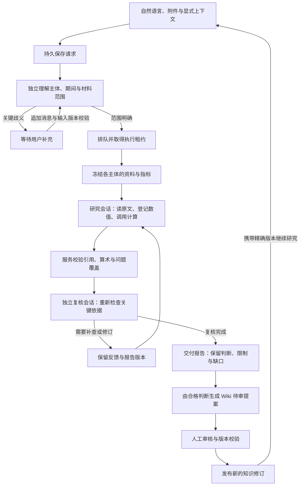

# Architecture：从研究问题到可复用知识

[返回 README](../README.md) · [真实案例](demo/README.md)

PITR 由研究、LLM Wiki、本机设置，以及共享的资料、计算、队列与 Agent 桥接组成。架构中的箭头表示控制或数据依赖，不表示每次研究都会执行全部可选能力。

## 1. 系统边界与模块职责

PITR 在同一用户的 Mac 上运行。React 页面经本机 HTTP API 访问 Python 服务；CLI 与 Slack 适配器进入相同的研究和 Wiki 命令服务。服务负责状态、工具执行和核验，模型通过隔离的本机 Agent 进程完成理解、研究、整理与复核。

**本机运行描述的是控制服务与存储的位置。** Codex／Claude 仍会访问所选模型服务，研究需要的提示与证据会进入相应调用；公开资料获取也需要网络。它不是完全离线的模型系统，也不是多用户远程托管服务。

| 模块 | 职责 | 边界 |
| --- | --- | --- |
| [`web/src/desk/`](../web/src/desk/) | 问题与附件、研究阅读、证据侧栏、Wiki 审核与设置 | 展示服务返回的状态；不裁定证据有效或直接写数据库 |
| [`src/pitr/desk/research/`](../src/pitr/desk/research/) | 输入理解、主体与范围、证据工具、数值核验、独立复核、报告及 Trace | Web、CLI、Slack 共用研究控制流程 |
| [`src/pitr/desk/`](../src/pitr/desk/) | 共享原件、快照、财务与经营模型计算、持久队列及 API | 控制服务执行工具、维护任务租约与事务 |
| [`src/pitr/agent_runtime/`](../src/pitr/agent_runtime/) | Codex／Claude 连接、模型绑定、会话、权限隔离、取消与进程回收 | Agent 通过受控工具读取当前研究材料；不能直接读取控制数据库 |
| [`src/pitr/wiki/`](../src/pitr/wiki/) | 收录、建库、整理、提案、审核、检索、版本、问题传播与重建 | Agent 可提议，正式发布须人工采纳并经服务校验 |
| [`src/pitr/integrations/slack/`](../src/pitr/integrations/slack/) | Socket Mode、事件去重、附件恢复、投递与私有配置 | 业务命令进入共享服务，投递状态由独立日志管理 |
| [`schemas/`](../schemas/) → [`web/src/types/`](../web/src/types/) | Python 契约导出 JSON Schema，再生成 TypeScript 类型 | 每个契约家族只保留当前一份，检查生成漂移 |

Codex 使用 App Server；Claude 使用结构化流式 CLI。研究者与复核者是不同角色、不同会话，未要求它们采用不同模型。一次研究绑定提供方、模型和连接信息；恢复时校验绑定，不能静默换模型续接。具体访问控制见[本机桥接](local-agent-bridge.md)。

## 2. 一次研究如何完成

这张图是主要路径。确定性核验与独立复核在执行循环中共同约束交付；未解决的错误、取消和中断会保留实际状态，不能沿图上的“复核完成”箭头直接进入交付。

### 输入、执行与恢复

- 问题先保存，再进入有租约和时限的独立理解通道。识别研究主体、参照与排除对象、期间和材料限制；关键歧义进入待补充状态。
- 多主体分别冻结来源与指标。跨公司、跨期间的计算核对单位、会计口径和频率，不相容的项目保留限制。
- 补充消息追加保存，使用操作身份去重并检查预期输入版本。同范围的执行中补充在工具结束后纳入；改变主体、期间或固定时点的要求形成关联修订。
- 队列只有持有当前租约的执行者可以提交进展。取消撤销执行权；迟到结果不能覆盖取消。重启保留检查点、证据与恢复记录，Agent 会话能否继续还要经过绑定和可用性检查。

### 三类检查分别证明什么

| 检查 | 可以检查 | 不能单独证明 |
| --- | --- | --- |
| 引用与数值完整性 | 引文能否定位原件、数字是否绑定、计算是否符合口径与公式 | 解释已经被证据充分支持 |
| 独立模型复核 | 重新读取关键依据，提出反证、遗漏和修订要求 | 模型判断没有共同偏差，或投资结果必然正确 |
| 人工采纳 | 研究者接受某项知识进入持续维护的版本库 | 对未来收益或业务走势的保证 |

交付可以是完整或保留明确缺口的部分交付。Wiki 交接还要求报告身份、最新报告版本、观点摘要、快照和当前交付状态一致；旧报告不能借用最新报告的核验状态。

## 3. Presentation layer：让结论与依据一起可读

研究的阅读结构同样是系统的一部分：用户需要先看清判断，再决定检查哪些依据。

1. **先给判断、缺口和下一步。** 后端 [`presentation.py`](../src/pitr/desk/research/presentation.py) 直接从已核验报告中选出关键判断、组织章节及可比指标，不另起模型调用改写首屏摘要。前端使用相同观点身份显示正文和依据。
2. **数字就是证据入口。** 报告中的绑定数字可以展开计算依赖与原文；引文保留来源、页面、期间及可得时间，读者能检查数字从哪里来。附件作者观点与官方原件保留各自身份。
3. **按阅读问题组织正文。** 先回答原始问题，再逐步展开完整观点、替代解释、核验记录和 Wiki 交接；技术执行信息放在“执行流程”和“Trace”。
4. **展开后能回到原位置。** 桌面使用依据侧栏，窄屏使用抽屉与焦点恢复；报告下载绑定选定版本，Wiki 历史阅读绑定精确修订。

这些设计减少用户为核对一句话而切换上下文的需要，但目前没有定量用户研究证明节省了多少阅读时间。详见[研究体验](research-experience.md)。

## 4. 数据：什么是依据，什么可以重建

**SQLite 文件整体不是可丢弃的缓存。** 它同时保存业务记录和查询投影。Wiki 的权威状态来自 SQLite 中的追加事件及其引用的冻结内容对象；Markdown、索引和 Wiki 查询状态是可重建的阅读／查询投影。研究任务、输入修订和报告等业务表也必须备份。

| 数据 | 用途 | 保存或恢复要求 |
| --- | --- | --- |
| 原始资料 `originals/` | 保存取得的原始字节及出处，支撑引用 | 保留摘要、修订与撤回关系；不能以重新下载的最新字节替代当次原件 |
| 研究快照 `snapshots/` | 固定当次可用资料、指标和上下文版本 | 与原件及对应业务记录一起保留 |
| 内容对象 `objects/sha256/` | 按内容摘要保存 Wiki 载荷、模型输出和发布正文等 | 校验完整性；摘要相同不等于内容真实 |
| `desk.sqlite` 的业务记录 | 研究请求、报告、任务、Wiki 事件、审核决定及 Outbox | 使用一致数据库快照，不能只备份 Markdown |
| Wiki 查询状态、检索索引与 Markdown | 为阅读、查询和导航服务 | 从冻结事件及对象重建；可选语义索引另行生成 |
| 外部 Agent 运行目录 | 逐次调用、会话和原生输出 | 默认在 `~/.pitr-research-runtime/`，按工作区隔离并配套备份 |

Wiki 事件记录已经接受的状态转移，证据记录说明知识依据，两者作用不同。重放使用冻结载荷，不重新调用模型，不产生新通知意图。Markdown 以完整目录代次生成，再原子切换当前阅读副本。

需要通知或后台工作时，Wiki 在同一事务中写入 Outbox（待转交的工作意图），再以稳定身份交给任务队列或 Slack 投递日志。重试可以恢复，不把跨库写入和远端发送假装成一个原子操作。

## 5. Wiki 如何持续积累

Wiki 分为**原始资料、知识 Wiki、维护规范**三层。知识正文保留事实、解释或方法的性质；规范独立版本化，约束整理、检查和发布。

发布时校验原件状态、目标版本、维护规范、数值绑定及研究交接身份。原件撤回或上游修订沿证据依赖传播复核事项，旧正文和原理由仍可历史阅读；恢复旧正文也通过发布新修订完成。

默认检索使用公司／专题导航与中文 BM25。可选本地语义检索增加跨语言召回，缺少模型或索引时明确回退；排序不能绕过公司、版本、时点和可用状态过滤。BM25 直接使用 SQLite，减少部署和模型准备成本；可选语义索引使用固定的 multilingual-e5-small 模型，以 RRF 融合关键词与语义排名。语义检索需要额外下载、存储和维护索引，不保证召回的解释正确。

## 6. 存储与后台工作的设计取舍

| 问题 | 选择与收益 | 代价与边界 |
| --- | --- | --- |
| 多页知识、审核决定与依赖必须一致 | 命令处理、追加事件、查询投影和工作意图在同一 SQLite 事务中提交 | 受本机数据库吞吐与单机可用性限制 |
| 文件写入和数据库提交可能中断 | 内容对象先写临时文件、flush/fsync 并原子替换，再提交数据库引用 | 中断可能留下未引用对象，需要管理磁盘容量 |
| 模型输出不可重复生成 | 冻结模型载荷、数值目录和发布正文，重放只读取已保存对象 | 保存完整依据比只保存最终 Markdown 占用更多空间 |
| 读者可能同时打开多个页面 | 生成完整 Markdown 目录，再原子切换符号链接 | 保留目录代次会增加存储占用 |
| SQLite 与 Slack 无法一起提交 | 事务 Outbox 加稳定操作身份，分别跟踪业务完成与消息交付 | 远端发送结果不确定时仍需要人工核对 |
| hook 与前台研究不能等待后台整理 | 采集先入持久队列；研究、Wiki 任务共用调度，前台优先 | 本机关闭时计划不会准时执行，休眠漏跑会合并 |

资料搜索只交付候选。受控下载器核对地址、大小、主体、期间与原始字节；保存原件和阶段记录后再转换。中断后复用成功阶段，继续处理缺口。取得搜索结果、取得正文、检查通过、人工采纳各有独立状态，覆盖不足保留为部分完成。

## 7. 备份与恢复

停止服务和其他写入进程后，成套保存数据目录与对应的 Agent 运行目录。Wiki 的 `research wiki backup` 提供一致 SQLite 快照、内容对象、原件、输入快照及摘要清单；运行文件和私有配置也应单独妥善保存。

在新的目录恢复备份，核对清单与内容摘要，再执行 `research wiki rebuild --root /absolute/restored-desk` 重建 Wiki 查询状态和 Markdown。重建不运行模型、不重新计算研究正文、不发送通知；可选语义索引需要显式重建。确认结果后使用 `./start --data-dir /absolute/restored-desk` 打开该目录。

Slack 中状态不确定的投递需要对照实际消息后决定是否重发。恢复方法及接口见 [Wiki 操作](llm-wiki.md#数据恢复与检索)、[本机桥接](local-agent-bridge.md) 和 [Slack](slack-integration.md#恢复与去重)。
