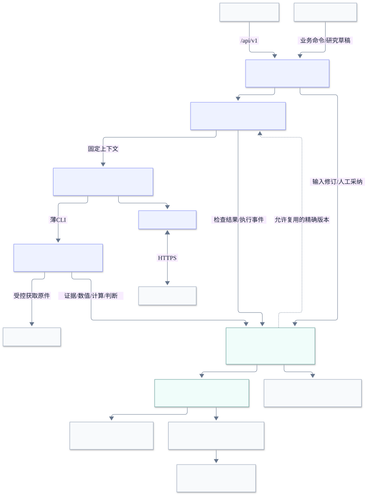

# 研究架构

Web 与 CLI 通过 `pitr.adapters.api` 访问 `/api/v1`，`Workstation` 统一执行研究、版本管理与渠道命令。

图中的执行与写入边界对应 [Workstation](../src/pitr/application/service.py)、[ResearchQueue](../src/pitr/research/queue.py)、[ToolService](../src/pitr/application/tools.py) 和 [Store](../src/pitr/application/store.py)。报告由 [Reports](../src/pitr/application/reports.py) 组织，Word 交付由 [ExportQueue](../src/pitr/artifacts/queue.py) 执行；[Mermaid 图源](architecture.mmd) 与展示图一同保存。

| 模块 | 职责 |
| --- | --- |
| `domain` | Pydantic 契约、数值与会计口径、主体与时点范围 |
| `application` | 不可变修订、对象存储、命令幂等、依赖传播、报告与采纳、备份、评测 |
| `research` | 提供方队列、租约、检查点、预算、独立复核、取材线索 |
| `skills` | 七类按需方法包与带来源的公司参考包 |
| `artifacts` | 原生 DOCX / OOXML / 图表工作簿、结构检查、逐页渲染、独立队列 |
| `adapters` | FastAPI、工具服务、原件与市场目录、本机运行上下文、Slack |
| `agent_runtime` | 官方 CLI 认证、模型固定、进程隔离、取消、会话恢复、受限模型网关 |
| `lab/news` | 已有新闻评分、反馈、本地模型；原件与研究草稿接入新内核 |

## 事实、版本与范围

`ResearchCase` 保存当前输入引用；`ResearchInput` 固定问题、主体、期间、时点、材料和执行选项。`Run` 固定输入修订、提供方、模型、预算、代次和 `Snapshot`。快照包含允许使用的来源、已采纳知识、主体版本和可复用对象。

原件以 SHA-256 内容寻址，`SourceVersion`、证据锚点、来源陈述、Value、Calculation、Assertion、ModelRevision、报告、检查、人工决定和 Artifact 都是不可变修订。SQL 触发器阻止覆盖和删除修订。新增修订检查预期 head；命令以 `operation_id` 和规范化请求摘要确保重试不会重复写入，复用标识但改变请求会冲突。

证据锚点保存准确来源版本、块、字符起止、原文与 PDF 页码。数值保留原文字面值和单位、期间、口径依据；Decimal 计算记录输入引用。主体、会计口径、单季/累计、币种、ADS/普通股与实际/预测角色须明确。对列含义、语义归因与复杂披露的判断仍由独立复核处理，确定性解析不会冒充全部金融语义已验证。

来源更正、撤回或判断/模型修订沿准确依赖传播当前有效性。快照内未实际使用的来源不自动污染报告依赖。旧正文、旧检查和已导出文件不改写。重新研究优先复用当前输入仍允许、依赖未变的对象；受影响的判断通过新修订恢复。

历史范围统一检查可得时间。页面自报日期不等于可得证明；受控官方目录、历史归档，或截止前已实际取得的原件才满足默认要求。历史知识只重放截止前的人工采纳决定。历史正文与当前有效性分别呈现。

## 执行与写入边界

Agent 只通过标准库薄 CLI 调用另一端口上的工具服务。凭据绑定 run、输入修订、代次、角色和租约；范围与有效性检查先于幂等缓存。长网络请求、PDF 解析和页图处理在事务外执行，返回后再次检查权限再写入。

每个宿主各有队列通道；运行租约定期续租，崩溃后可由新代次接管。取消与输入修订撤销凭据并终止进程组；服务崩溃时守护进程回收子进程。服务中断后的恢复沿用固定上下文与检查点。候选/verified 双工作区重放不再存在。

macOS Seatbelt 限制文件访问，禁止 Agent 直接访问业务库、其他任务和外部网络。出站仅允许受控工具端口与当前调用的模型网关；网关只允许对应提供方和用户配置的精确 HTTPS 模型/认证主机，保留宿主原有代理连接。公开研究获取必须经过工具服务，历史研究禁用公开发现与获取。官方 CLI 仍负责原生认证和刷新；PITR 不复制登录密钥到业务备份。

## 报告、审核与交付

网页和 Word 读取同一 ReportDocument：章节、段落、类型化数值、引用、表格和图表。核心财报、公司和产业报告必须登记判断对象；段落判断须包含在报告判断列表中。金额、比率不能手抄为普通正文文本。

确定性检查与独立复核分别保存准确目标版本。独立复核使用新会话，得到报告、依赖对象与原件上下文，必须覆盖全部核心判断；不能修改研究。简单原句定位可为“不适用”。未执行、不可用、错误、失败和通过分别表达。修订报告独立排队复核，可单独重试。

人工采纳绑定准确对象版本。独立判断分别采纳，有依赖的判断形成原子组；来源身份不决定关系成熟度。来源变化、旧 head 或检查错误阻止错误采纳。人工决定、报告检查和报告交付不是同一个状态。

导出单独排队，初始并发 1。请求冻结检查版本与交付状态；Artifact 保存 DOCX 摘要、模板/编译器版本、渲染清单和检查结果。重试不调用研究。Word 图表含原生 OOXML 和可编辑 XLSX 数据，空值保持缺项；工作簿按 IEEE-754 能力核验，原始 Decimal 保留在研究内核。

## 派生视图与恢复

公司、知识、关系、模型与检索均从版本对象和人工决定派生，检索可重建。资讯保留自己的实验评分历史，但正式研究的公司、证据与判断来自统一内核；分数没有研究核验资格。

`CompanyView` 按同一主体与时点投影知识、原件摘要、数值、模型、报告摘要与历史。历史名称优先使用截止前已登记的主体修订；若无当时的登记，当前名称只用于目录导航并明确提示。原件和正文按需读取准确修订；历史正文旁单独显示当前有效性。React Flow / ELK 只负责布局，关系成熟度来自判断语义，来源身份标签不改变成熟度或采纳资格。

`TraceView` 从持久执行事件重建运行图和瀑布图。Agent、受控工具、独立复核、报告冻结、Word 尝试、取消和恢复保留父子、输入修订与代次关联。调用区间独立计时，只有开始/结束事件的导出标为观察间隔；旧记录缺失的耗时不补造。历史回放不读取未来状态和结果。尝试记录与正式提交分开，失败或过期能力可以留下审计记录，但不能改变业务对象或预算。

`/api/v1/runs/{id}/trace` 返回图形结构与摘要；`trace/spans/{span_id}` 按选择加载输入输出和宿主事件；`trace/records` 提供原始记录；`trace/events` 用可恢复游标推送轻量通知，不广播原件或工具输出。前端将 Trace、运行图、公司图表、报告图表和 PDF 分开按需加载。

备份使用 SQLite 一致快照，包含业务引用所需内容对象、原件、文件与渲染页、方法包、取材回执及资讯/渠道日志。恢复验证清单、摘要和引用，撤销运行凭据。未完成工作从检查点排队；已有结论和历史文件不调用模型重造。恢复的 Slack 待投递与绑定暂停，防止重复发送。
