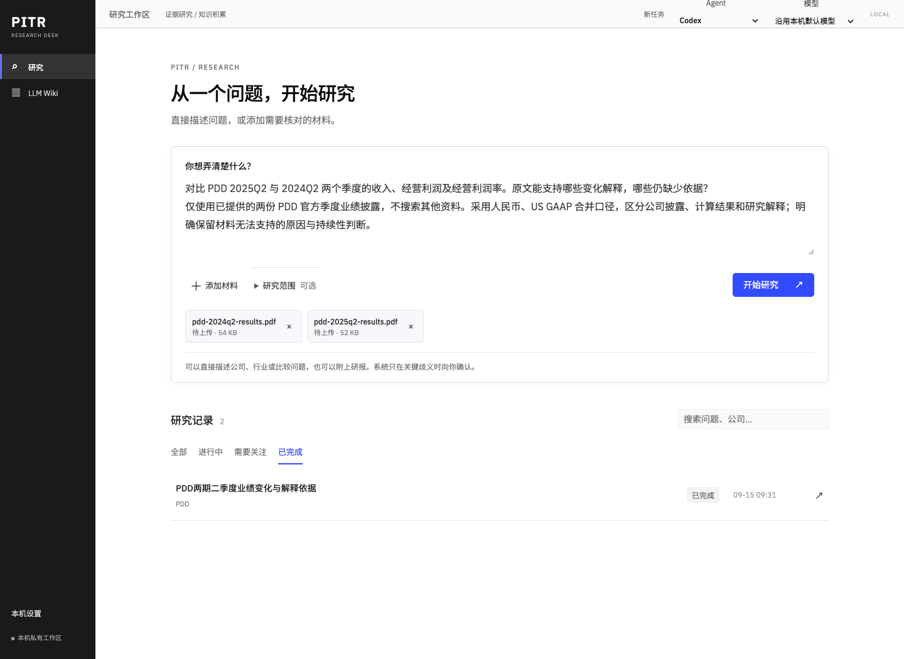
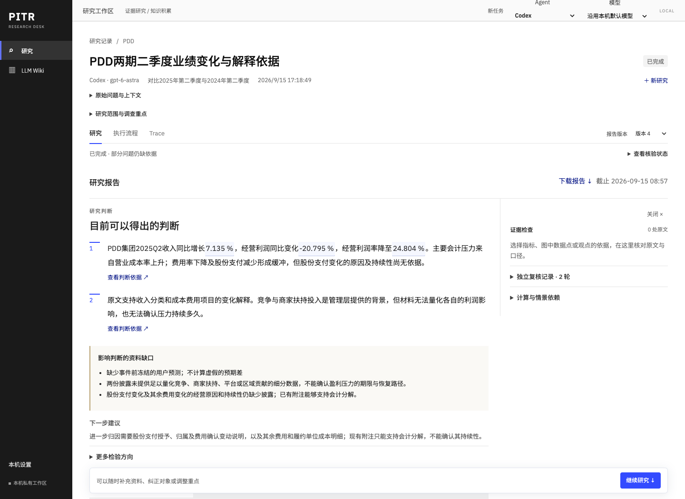
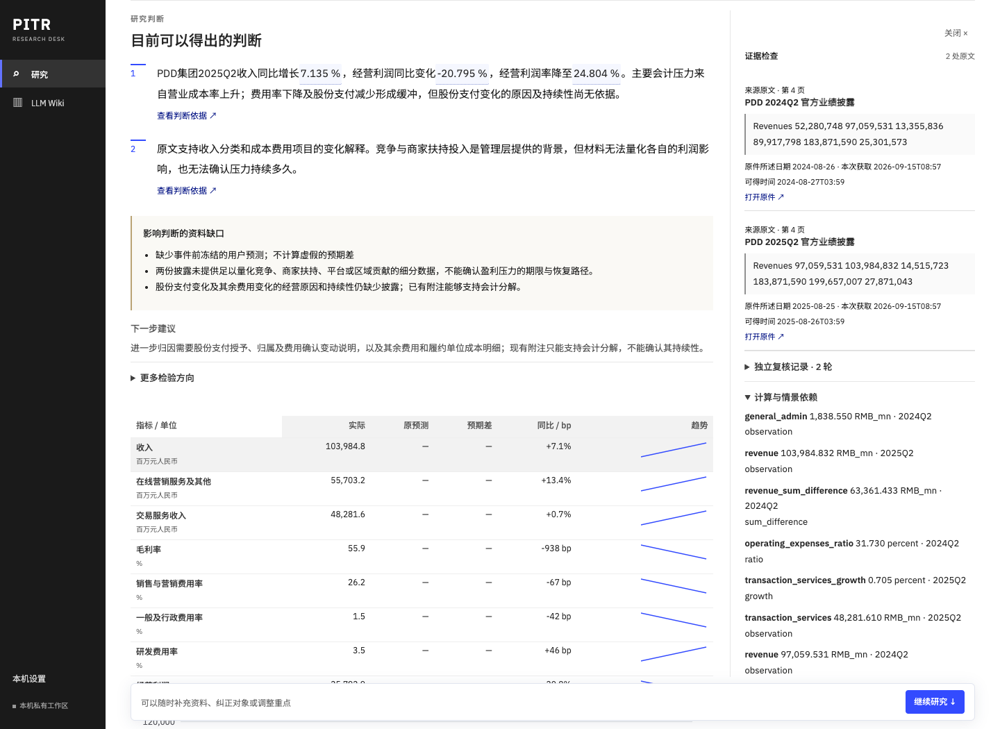
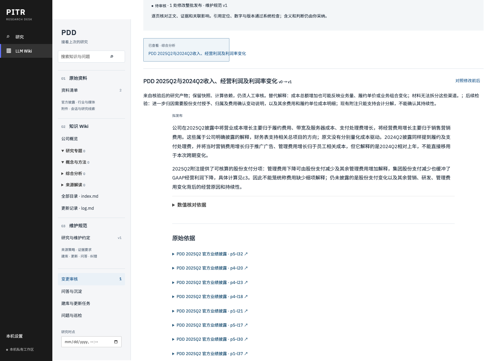

# Demo：PDD 两期披露的证据研究

[返回 README](../../README.md) · [完整 HTML 报告](research-report.html) · [架构说明](../architecture.md)

这一案例从两份公开原件开始，比较收入、经营利润与经营利润率，区分**披露事实、计算结果和研究解释**，最后把合格判断送入 Wiki 待审提案。

## 问题与材料

> 对比 PDD 2025Q2 与 2024Q2 两个季度的收入、经营利润及经营利润率。原文能支持哪些变化解释，哪些仍缺少依据？

范围限定为所提供的两份官方披露，采用人民币、US GAAP 合并口径；不搜索其他材料，明确保留披露无法支持的原因与持续性判断。完整输入见 [question.txt](question.txt)。

| 原件 | 披露日期 | 核对范围 |
| --- | --- | --- |
| [PDD Second Quarter 2024 Unaudited Financial Results](https://investor.pddholdings.com/static-files/fd51ce6f-19eb-4ec7-a505-0bfe3bf30fb8) | 2024-08-26 | 标题、季度、人民币口径、合并利润表、费用说明 |
| [PDD Second Quarter 2025 Unaudited Financial Results](https://investor.pddholdings.com/static-files/284c873a-332b-4fb6-b2d8-a9bfed73dbbe) | 2025-08-25 | 标题、季度、当期与上年同期列、合并利润表、费用说明 |

2026-09-15 从发行人站点获取，两份均为 6 页 PDF。核对内容包括标题、期间、主体和关键财务页面。[sources.json](sources.json) 保存 URL、内容摘要、大小、页数及核对时间；仓库只保存公开来源清单，不复制整套业务数据库或原始 PDF。

这是现在对历史期间的研究，**不是重现 2025 年当时可得信息的回测**。来源的披露日期、本次获取时间和研究快照时间分别保留。来源下载可能受站点限流或访问状态影响，不能以替换字节后继续沿用旧摘要的方式复现。

## 这份报告回答了什么

收入增长，但经营利润与经营利润率下降。报告版本 4 的同口径比较如下；金额为人民币百万元，采用集团 US GAAP、未经审计的季度口径。

| 指标 | 2024Q2 | 2025Q2 | 变化 |
| --- | ---: | ---: | ---: |
| 收入 | 97,059.531 | 103,984.832 | +7.135% |
| 经营利润 | 32,564.536 | 25,792.899 | −20.795% |
| 经营利润率 | 33.551% | 24.804% | −8.747 个百分点 |

金额来自两份披露的合并利润表；同比与利润率由受控计算得出，显示值按报告精度取舍。完整计算和原文定位保存在[报告](research-report.html)中。

原文能支持成本费用和股份支付的会计分解；竞争、商家扶持等是管理层提供的背景，仍不能从这两份材料量化各自对利润的影响或确认持续性。案例保留这个边界，并将费用变化解释提交 Wiki 审核。

## 四个画面

点击截图可查看原尺寸。

### 提出问题

[](research-question.png)

画面使用本次研究的相同问题和相同 PDF 字节展示网页输入，附件处于“待上传”状态。本次实际研究由共享研究控制面创建，并固定已按官方 URL 入库的原件快照；截图未再次提交研究。它演示输入方式，研究结果来自下方记录的真实执行。

### 阅读判断

[](research-report.png)

先查看已核验判断和影响结论的资料缺口；查看正文数值对应的原文，而不是仅凭摘要接受解释。

### 检查证据

[](research-evidence.png)

同一报告中的绑定数字打开依据侧栏，保留原文、页面、期间和计算关系。原件可以单独打开；“下载报告”导出当前选定的报告版本。

### 提交知识审核

[](wiki-proposal.png)

提案通过产品中的“Wiki 提案”动作生成。拟发布正文保留报告、观点、快照、原件和数值绑定，状态为待审，尚未人工采纳。

## 复现这次运行

普通使用从项目根目录执行 `./start`，选择已登录的 Agent，输入问题并添加材料即可。若需要与本次案例一样，**只运行固定的两份官方原件**，按下面的独立目录步骤操作；使用共享研究服务固定资料范围。

先安装开发依赖 `uv sync --extra dev`。下列代码下载并验证公开原件，创建独立数据库、固定快照，运行真实的输入理解和研究／独立复核。`PITR_DEMO_ROOT` 必须指向不存在的目录；默认使用 `tmp/pitr-readme-replay`。提供方和模型沿用本机 Codex 配置，推理强度明确使用 `medium`，活跃执行预算为 30 分钟；可用 `PITR_DEMO_AGENT=claude` 选择已登录的 Claude；模型输出和耗时不保证逐次相同。

```sh
uv run python - <<'PY'
from pathlib import Path
import hashlib, json, os
import httpx
from pitr.agent_runtime.runtime import AgentRuntime
from pitr.desk.service import Desk
from pitr.desk.tasks import Queue
from pitr.desk.contracts import utcnow
from pitr.desk.research.service import Research
from pitr.desk.research.contracts import ResearchRequest
from pitr.desk.research.intake import IntakeWorker

root = Path(os.environ.get('PITR_DEMO_ROOT', 'tmp/pitr-readme-replay')).resolve()
if root.exists():
    raise SystemExit('请指定不存在的数据目录，已有研究不会被覆盖')
desk = Desk(root)
desk.agents = AgentRuntime(desk)
desk.agents.save_selection({'agent_provider': os.environ.get('PITR_DEMO_AGENT', 'codex')})
try:
    sources = json.loads(Path('docs/demo/sources.json').read_text())
    source_ids = []
    for source in sources:
        response = httpx.get(source['url'], follow_redirects=True, timeout=45)
        response.raise_for_status()
        raw = response.content
        if hashlib.sha256(raw).hexdigest() != source['sha256']:
            raise SystemExit('原件摘要已变化，请核对来源后新建案例')
        doc = desk.ingest(raw, 'application/pdf', source['url'], 'PDD',
                          'PDD ' + source['period'] + ' 官方业绩披露')
        source_ids.append(doc.id)
    snapshot = desk.snapshot('PDD', utcnow())[0]
    queue = Queue(desk)
    research = Research(desk, queue)
    request = research.create(ResearchRequest(
        operation_id='readme-public-pdd-replay',
        question=Path('docs/demo/question.txt').read_text(),
        company='PDD', period='2025Q2', snapshot=snapshot,
        source_ids=source_ids, budget_seconds=1800, tool_budget=180, reasoning="medium",
    ))
    print('研究身份：', request['id'], flush=True)
    IntakeWorker(desk, queue).run_one()
    if research.get(request['id'])['task']['status'] == 'queued':
        queue.run_one()
    current = research.get(request['id'])
    print('执行状态：', current['task']['status'])
    print('数据目录：', root)
finally:
    desk.agents.shutdown()
PY
```

代码只启动一次理解和研究工作，没有启动 Wiki 后台建库或更新调度。真实模型调用需要本机 CLI 登录与可用额度；遇到澄清、中断或资料缺口，保留实际结果，从页面检查后续步骤。

要阅读该目录中的结果，在仓库根目录执行：

```sh
./start --data-dir tmp/pitr-readme-replay --port 8887
```

若设置了其他 `PITR_DEMO_ROOT`，将 `--data-dir` 改为该路径。正常启动会启用后台服务，后续整理可能形成额外待审草稿；它不会自动采纳知识。打开对应研究，点击绑定数字核对原件，选择“下载报告”；展开“完整观点与审核交接”，对可交接的判断点击“Wiki 提案”，再到 Wiki 的变更审核阅读拟发布正文。

## 案例身份与资料缺口

| 项目 | 记录 |
| --- | --- |
| 运行时间 | 2026-09-15 17:18–17:31（Asia/Shanghai） |
| Agent | Codex · `gpt-6-astra` · `medium`；CLI `0.154.0-alpha.6.2` |
| 报告 | 版本 4；请求 `research_f1183d90f5e04f5689b6` |
| 检查状态 | 引用与数值完整性通过，独立复核通过 |
| 交付状态 | `partial`：保留因果解释与持续性等资料缺口 |
| Wiki | 费用变化解释提案待审，绑定该报告与同一快照；尚未人工采纳 |

案例没有事前冻结的用户预测，因此不计算预期差。两份披露能够支持费用与股份支付的会计分解，但缺少量化竞争、商家扶持、平台或区域贡献的数据，也不足以确认盈利压力的期限与恢复路径。

[run-summary.json](run-summary.json) 保留模型、运行时间、请求、快照、最终报告与提案身份。报告编号表示研究产物的业务修订。截图直接来自真实页面，统一为 1440 × 1050；报告、数值与状态均保持原件。输入画面展示相同问题与 PDF，实际请求由共享研究服务创建，详见上方说明。
