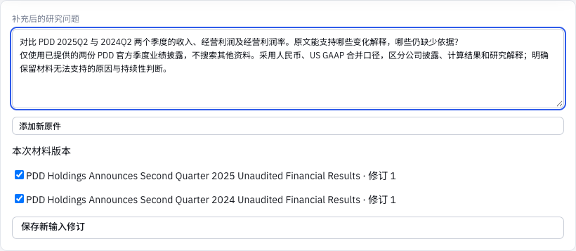
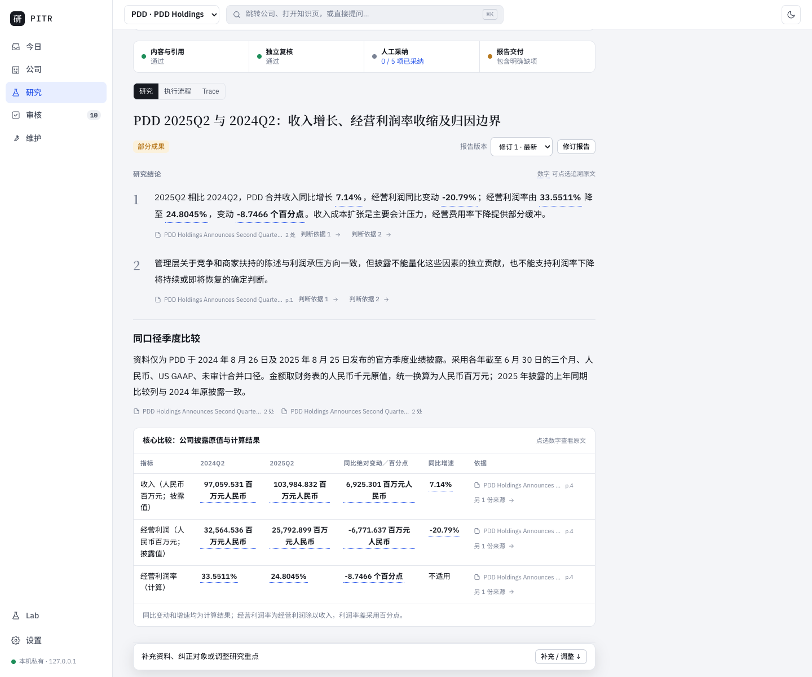
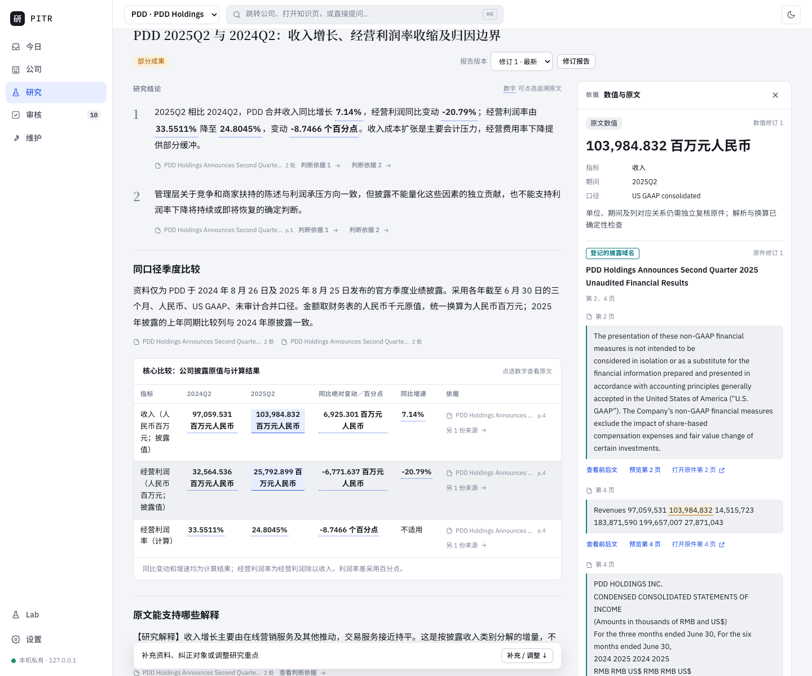
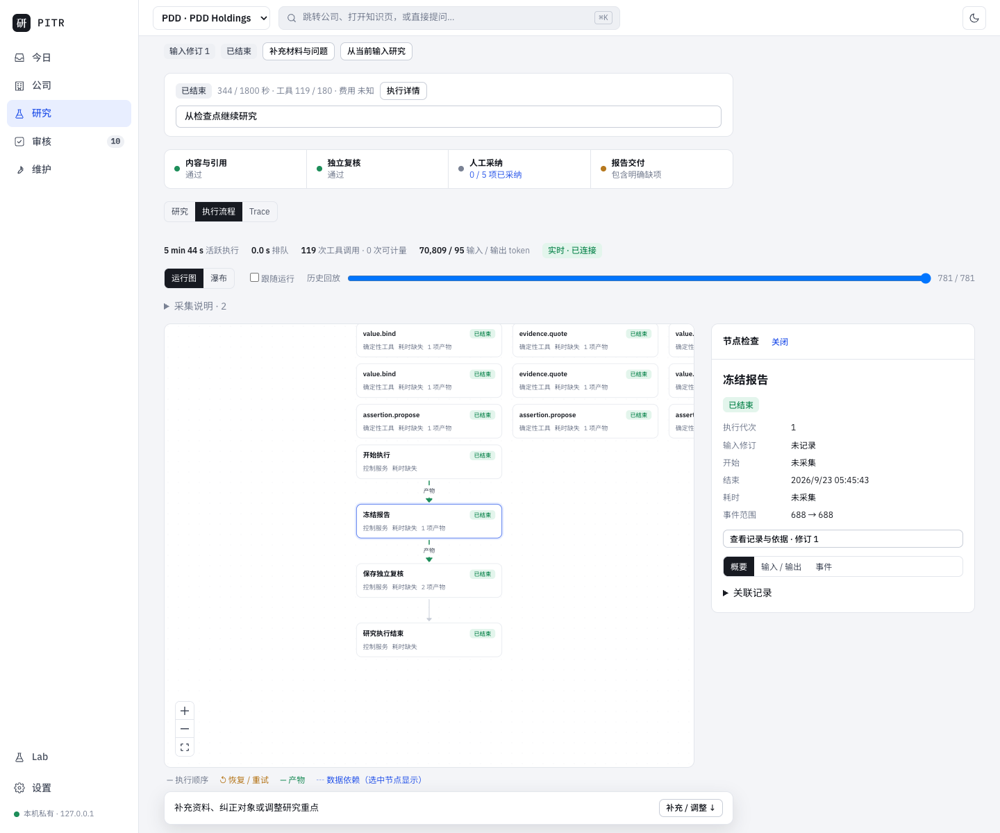
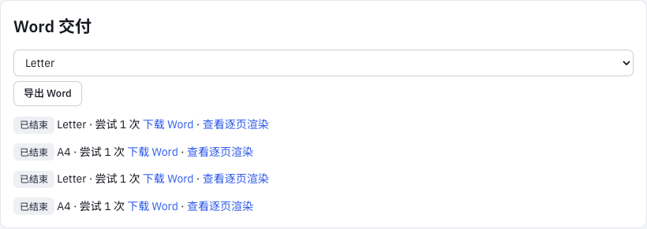

# 真实使用示例：PDD 两期官方披露

本案例比较 PDD 2025Q2 与 2024Q2 的收入、经营利润和经营利润率，限定人民币、US GAAP、三个月的合并口径。研究由 Codex 读取两份官方 PDF、登记数值与计算、形成判断，再由独立会话复核。截图是在当前代码运行的工作台中打开该真实记录后截取的，报告与原件保持其保存版本。

## 材料与问题

- [完整研究问题](question.txt)
- [2024Q2 官方业绩披露](https://investor.pddholdings.com/static-files/fd51ce6f-19eb-4ec7-a505-0bfe3bf30fb8)
- [2025Q2 官方业绩披露](https://investor.pddholdings.com/static-files/284c873a-332b-4fb6-b2d8-a9bfed73dbbe)
- [原件网址与文件摘要](sources.json)

重新打开研究输入，可以看到保存的问题与所选材料。新增材料或改变问题会形成新的输入修订。

## 阅读结论与限制

报告先呈现数值变化和归因边界，再展开同口径比较与解释。内容检查和独立复核通过，人工采纳仍为待决定；报告因材料无法支持完整的经营归因与持续性判断而保留“部分成果”状态。

## 从数字回到原件

点选本期收入后，侧栏展示换算后的金额、期间、口径和原文。披露数值所在的财务表行、单位与期间表头、会计口径说明都有各自的定位，可以继续打开对应 PDF 页。

## 查看执行与产物

报告节点连接实际保存的产物与复核记录。该研究的一部分调用只保存了完成事件，因此缺失的调用区间会显示为未采集；可从节点详情阅读已有记录。

Word 交付使用同一报告修订，保留 Letter 与 A4 文件以及渲染预览。已导出的文件保持不变，继续研究或修改正文会产生新的修订。

[返回项目介绍](../../README.md) · [研究、修订与导出说明](../research.md)
