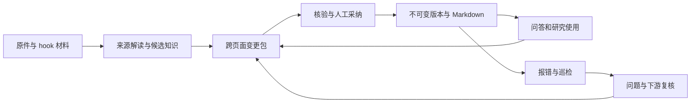

# LLM Wiki：持续研究与知识维护

[返回 README](../README.md) · [架构说明](architecture.md)

Wiki 将原始资料整理为带依据的知识，通过人工审核发布，再用于后续研究。执行 `./start`，在侧栏打开 LLM Wiki，可以建库、更新、提问、审核和处理问题。

## 构建、更新与提问

### 工作台操作

打开 `/wiki` 默认进入公司概览。三层目录始终有入口，窄窗口为抽屉；页内目录、精确版本地址、反向引用、下游用途和历史比较服务于完整阅读。点击数字会打开可调宽度的依据侧栏，包含原文、相邻上下文、PDF 页定位、期间、单位及计算绑定。关闭后回到原阅读位置；正文地址保留公司、页面、版本、时点和引用位置。历史模式只开放当时的资料、页面、规范及记录；处理任务和审核须返回当前研究。

- **构建公司 Wiki：** 输入代码与研究重点，可登记其他公司名称、别名、官方域名和来源目录。默认最近三个财年、八个季度，预算二十分钟，官方＋行业与媒体。研究运行时实时搜索，随后由受控下载器获取原件。只找到摘要的候选不会作为证据。
- **更新 Wiki：** 先读取已有页面、待审提案、问题和上次来源检查；重新获取重要 URL 的字节摘要，发现同 URL 修订后保留旧源、传播复核事项，整理为新的整批提案。默认十分钟；失败、覆盖不足和未检查项明确列出。
- **更新设置：** 每日、每周或自定义星期与时间，显式时区。默认周一九点；首次建库不开启计划。本机调度器合并休眠漏跑，同公司排队，前台研究优先。可调整、暂停、恢复、取消；完整检查无变化时不发送提醒。
- **提问：** 先读公司与当前专题，再检索；记录检索上下文与实际使用版本。数字从原始观察和确定性公式绑定，坏引文、错误绑定或不可用版本不能成为有效回答。资料不足可主动启动补查。编辑分析后再次校验，重复正文复用提案。
- **审核：** 先看整体修改原因、规范、涉及资料与页面，再逐页读新正文或比较前后，最后整批采纳。过期输入或目标版本会阻止提交。

### Slack 与 CLI

Slack 先识别操作意图，再决定执行任务或收录材料。示例：`构建 PDD Wiki，重点研究利润率与现金转化`、`更新 PDD Wiki`、`每周一 09:00 Asia/Shanghai 更新 PDD Wiki`、`暂停 PDD Wiki 更新`、`取消 PDD Wiki 定时更新`、`PDD Wiki：现金转化的依据是什么？`。同一线程保留公司与专题上下文。建库消息的可解析附件进入本批来源，避免逐份触发整理；上传和会话内容不会升级为官方披露。

回答附引用和完整使用记录，可用按钮保存到专题或独立分析草稿。`审核 PDD Wiki` 返回完整变更文件，审核按钮绑定原用户、摘要与目标版本；采纳记录保留 Slack 用户身份。调度提醒通过知识事务 Outbox 转交 Slack 队列。

CLI 使用 `research wiki build`、`research wiki update`、`research wiki jobs`、`research wiki schedule`，具体参数可用各子命令的 `--help` 查询。hook 安装与手动收录见下文。工作台、Slack、CLI 和 MCP 的 Agent 能力共用同一命令服务；Agent 接口不提供发布权限。

### 可靠性与覆盖边界

任务、阶段结果、来源检查与计划都由事件恢复。下载成功即冻结原始字节并提交阶段记录；转换中断后可以复用原件。PDF 转换在独立进程中限时执行。重定向逐次检查公共地址，下载限制四十 MB；有限重试及 HTTP 失败有回执。候选主体先匹配登记名称与别名，再核对官方域名；正文季度与候选季度冲突时只保留原件和错误，不进入有效证据。

覆盖清单中的“找到材料”只表示获得了相应材料，不表示其命题已经通过语义核验。同业及行业保持自己的主体，转载和相同字节保留来源关系；是否支持某个投资判断仍需逐条人工审核。财务数值提取与复杂计算深度覆盖 PDD，其他公司的未支持数值需明确留作缺口。

实时搜索可成功而原站下载失败。此时任务为部分完成，可继续，不显示“未发现更新”。本机关闭时不承诺定时执行。下载、模型、引文与数字检查通过也不等于语义解释已被证实，更不等于人工采纳。

任务页区分连接失败、需要配置、访问拒绝、正文未取得和替代入口成功；“继续补查”复用已保存原件，保留历史失败并针对缺口补搜。SEC 联系信息沿用本机设置。下载、重试、解析、补搜和整理共用任务预算；没有取得正文的候选不进入有效证据。

## 三层与生命周期

- 原始资料：不可变字节、来源定位、出处、可用时间、采集时间、修订与撤回关系。官方原件通过资料导入；聊天和 Agent 产物提供线索与解释。
- Wiki：来源解读、公司、概念与方法、研究专题、综合分析。独立知识保留事实 / 解释 / 方法性质与适用范围，页面保留叙述和精确版本关联。
- 维护规范：独立版本，提议、审核、发布沿用同一服务。初始规范明确标记为安装默认版本，人工核验单独记录。



工作台可一起编辑多个页面与知识，核验后整体审核。审核包显示正文、方法字段、证据和关联版本的前后变化。来源、输入状态、目标版本或规范发生变化时，旧提案无法提交。恢复历史正文也需要起草新版本。

问答先给出公司和专题页，再检索知识；可以让模型起草分析，也可直接记录人工研究。实际使用版本与原始引文保留，有价值的分析提交为提案。重复正文及同一证据集合复用已有提案。历史任务可指定时点：后来发布的总结和后来纠错状态不进入当时的上下文；历史审计可另看完整演变。

资料整理会读取已发布 Wiki、相关季度原件、上年同期和年度业务背景，按页面阅读目的生成完整研究正文。来源解读包含同口径指标和实际桥接，公司页包含收费及经营机制，专题页比较竞争性解释及改变判断的条件。长年报选取业务与会计政策的上下文，并显式记录摘录范围，不能据摘录缺口断言整份原件未披露。

数值由原始指标与确定性公式生成可引用目录，模型只选择标记；服务展开为正文数字、引文链接、准确位置及计算绑定。原始值保留精度，显示采用明确的四舍五入规则。目录、模型原始输出与修订正文分别冻结，重建不重新计算研究内容。审核支持连续阅读拟发布版本、查看公式和操作数、点击数字展开原始证据；Markdown 同样保留证据锚点。阅读、历史、问答及审核前后版本分别维护自己的证据定位，点击数字在侧栏展开对应原文，可打开原件并返回原阅读位置；缺失目标明确提示。模型问答复用同一数值目录，生成的数值逐处绑定原始指标或确定性计算；未支持的计算保留为缺口。手动分析中的数字可在工作台绑定原始指标，期间和计算绑定也可通过 API / CLI 契约提交。模型完成时保留用户已开始的编辑；更换研究问题或公司后重新建立阅读上下文。

## 安装和采集

从项目安装和启动：

```sh
uv sync --extra dev
cd web
npm ci
npm run build
cd ..
./start
```

在要采集的项目目录安装 hook。若该目录不是工作台所在目录，显式传入工作台数据目录的绝对路径：

```sh
research wiki hooks install claude --scope project --root /absolute/path/to/pitr/data/desk_control
research wiki hooks install codex --scope project --root /absolute/path/to/pitr/data/desk_control
research wiki hooks doctor --root /absolute/path/to/pitr/data/desk_control
research wiki hooks test --provider claude --root /absolute/path/to/pitr/data/desk_control
research wiki drain --root /absolute/path/to/pitr/data/desk_control
research wiki hooks uninstall claude --scope project --root /absolute/path/to/pitr/data/desk_control
```

在项目本身运行时可用 `uv run research ...`；已安装 `research` 时直接运行。也可用 `uv tool install .` 安装当前本地项目。默认 scope 是 project；需要用户范围时显式指定 `--scope user`。含空格路径使用 shell 引号。安装器使用当前 Python 的绝对路径，合并、备份现有配置，按登记的精确内容升级和卸载。

提供方原生信任需要在 Claude Code / Codex 中完成；PITR 不绕过信任。Codex 的 `/hooks` 可查看并信任新定义。测试命令检查本机采集入口；还需在真实会话提交一条公司研究材料，确认 hook 已被提供方执行。在 Wiki 原始资料中检查是否收录，公司不明确时手动归类。

可以把以下操作交给安装助手执行：在指定研究项目运行上述 install、doctor、test；报告配置文件位置、备份和测试结果；提示用户在提供方原生界面信任，然后等待用户在真实会话发送材料。助手使用同一安装器，不手工覆盖配置，不代替原生信任。

两类 hook 均安装 UserPromptSubmit、PostToolUse、Stop、SessionEnd。入口只读取公开字段，忽略 transcript_path 和隐藏推理，过滤凭据及无关工程内容，先持久化再返回。不调用模型或生成向量。后台合并会话材料、恢复离线积压。Codex 的托管工具不保证经过工具 hook；不宣称全量会话捕获。

Slack 使用 owner/workspace/channel 权限、Socket Mode 和附件接收。通过“收录”或“保存到 Wiki”发送公司研究材料；命令执行对应工作流。已接收消息的编辑、删除只作用于原先被采集的身份，追加来源修订或撤回。通知意图由 Wiki 事务 Outbox 转交 Slack Journal；机器人产物有标记并跳过回声。配置与连接方式见 [Slack 指南](slack-integration.md)。

## 纠错与巡检

审核状态与可用状态分开。确定性失败先由服务复现；仅用户或模型声称“引文错了”不会直接隔离。摘要、引用、数值或计算失败可自动隔离；语义疑点标争议并展示上下文。

纠错发布 `K@vN`，明确 `corrects`，保留旧版及其理由。沿 supports、derived_from、used_in 追踪下游；普通 related 链接不触发失效。当前报告保留原文，使用记录进入复核；研究提案直接绑定报告、计算及精确 Wiki 版本，实质变更继续走审核。关闭问题前，旧版本必须退出正常引用，且每个下游对象都有处理决定。“已修订”必须有新版本，不能只点一个状态。

关联方向明确区分：`A derived_from B` 表示 B 是 A 的依据；`A supports B` 或 `A used_in B` 表示 B 使用 A。校验和影响传播统一按精确版本的“依据 → 使用者”处理；同一证据关系的双向描述不构成循环。引用旧版本也不会仅因稳定身份相同而被误判为循环。

每天规则巡检检查原件、引文、数值、链接、索引、Markdown 和遗漏工作；每周语义巡检检查证据超推、限制遗漏、矛盾、重复定义、孤立与缺口。最多二十条、十分钟，一半高影响、一半最久未检查；前台研究优先，休眠只合并补查一次。具体疑点附原文，未完成、跳过、失败和预算耗尽均有记录。完成后可登记人工复核耗时、确认误报与漏报，指标接口汇总实际记录；未复核的检查不伪造效果分数。历史事实不按年龄失效。

## 数据、恢复与检索

同一工作台目录下：

```text
 desk.sqlite               # Wiki 事件、命令、投影、Outbox，与 Desk 共库
 objects/sha256/ab/cdef…    # SHA-256 全摘要对象
 capture/queue.sqlite      # hook 轻量持久队列
 wiki -> .wiki-projections/<generation>
   index.md
   log.md
   pages/*.md
   knowledge/*.md
   schema/*.md
 models/multilingual-e5-small/<revision>/
```

Markdown 包含页面身份、版本、状态、规范和发布序列，在工作台编辑。读取副本前后可核对序列，提交引用前仍校验当前可用性。

```sh
research wiki rebuild --root /absolute/desk
research wiki backup /absolute/new-backup-directory --root /absolute/desk
```

重建仅重放冻结事件和对象，并重新生成状态、索引与 Markdown；不调用 LLM，不生成通知意图，不转发已有通知。语义向量清空后需显式重新建索引，期间 BM25 继续可用。备份包含 SQLite 一致快照和内容对象、原件、输入快照及摘要 manifest。恢复使用新的目录，先核对备份摘要，再重建；远端通知的未决交付状态需要按 Slack 恢复流程处理。

默认目录与 Jieba 中文 FTS5 BM25。可选语义能力：

```sh
uv sync --extra wiki-semantic
uv run research wiki model install --root /absolute/desk
uv run research wiki model index --root /absolute/desk
uv run research wiki search '利润率持续性' --company PDD --hybrid --root /absolute/desk
```

模型安装显式下载约半 GB 的固定模型，首次查询不会下载。ONNX 使用 ARM64 通用 CPU 模型，E5 的 query/passage 规则和 tokenizer 版本锁定；向量存 SQLite，NumPy 精确余弦，RRF 各取五十项再等权融合。缺失模型、未建索引或校验失败时保留 BM25，并报告回退原因。未引入查询扩展或 reranker。

## 当前接口

`/api/desk/wiki` 提供总览、captures、sources/classify、sources/compile、proposals、proposals/review、issues、issues/decisions、query、query/answer、answers、search、pages、versions、lifecycle、policy、inspections、inspections/{id}/feedback、inspection-metrics、validate、rebuild 和 Outbox retry。所有修改经服务层；CLI 的 capture/propose/report 接受契约 JSON。

`research wiki mcp` 提供收录、Wiki 阅读、问答使用记录、提案、报错与 `wiki_validate` 引用校验；不注册发布工具。读取 Markdown 后可用 validate 按公司、精确版本和时点检查状态、正文与证据完整性。研究快照 MCP 提供 company_wiki，研究任务先读取已有综合，并记录模型声明实际使用且通过校验的精确版本。HTTP 控制面仍运行在本机工作台信任范围内，不作为面向不可信用户的多租户服务。

研究提案直接进入 Wiki 审核，并校验报告身份与数值依据。发布记录保留精确版本，可按研究时点阅读和复用。
